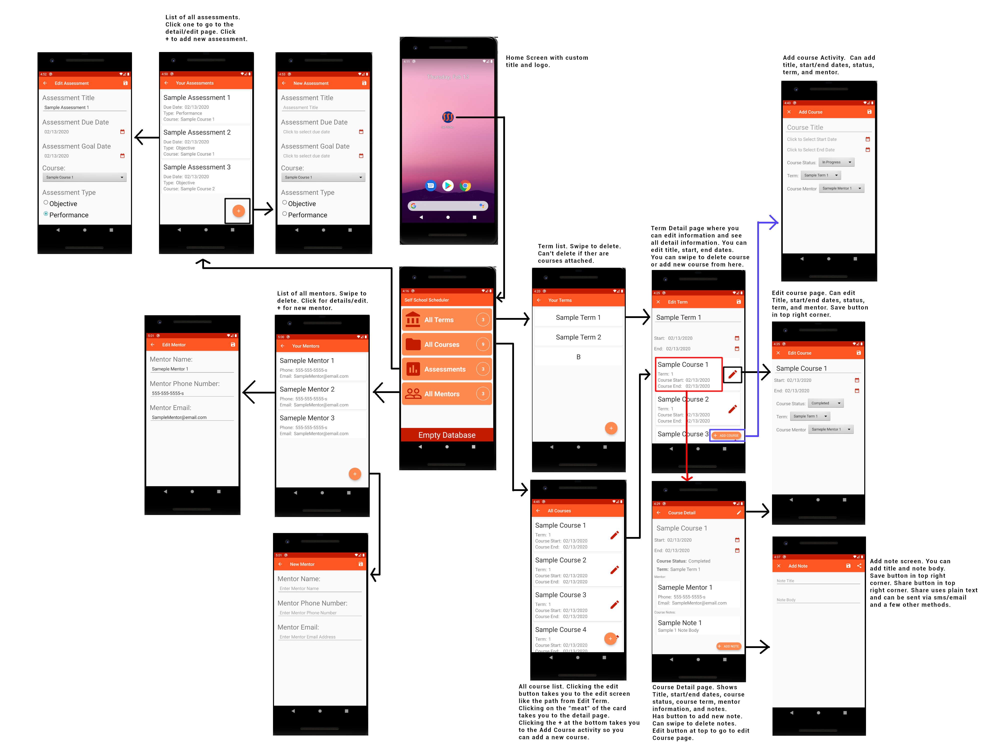

# TE_Scheduler_C196
Project for C196 at WGU

This android mobile application allows you to create terms, add courses to terms, add notes and assessments to courses, and associate mentors with courses.
All of these can be modified or deleted as necessary. 

Terms that have courses associated cannot be deleted.  

If a course has notes or assessments associated, you will be promted to verify course deletion. 
If you delete a course with something associated to it, those items will be deleted as well.

This application contains multiple activities, a SQLite Room db instance stored locally on the device, and
CRUD functionality.

